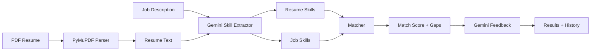

# Resume Analyzer

AI-powered resume vs job description analyzer. Upload a PDF resume, paste a job description, and get a match score, skill gap analysis, and personalized improvement suggestions powered by **Google Gemini**.


---

## What It Does

1. **Upload** a PDF resume and extract clean text
2. **Paste** a job description
3. **Extract** skills from both using Gemini AI
4. **Compare** resume skills vs job requirements
5. **Get** match score, missing skills, strengths, and improvement tips

---

## Features

| Feature | Description |
|---------|-------------|
| PDF Processing | Extracts and cleans text from resumes using PyMuPDF |
| Skill Extraction | Gemini LLM with keyword-based fallback |
| Match Scoring | 0–100% score based on skill overlap |
| AI Feedback | Strengths, gaps, and learning recommendations |
| REST API | FastAPI backend with Swagger docs |
| Streamlit UI | Simple drag-and-drop web interface |
| Analysis History | Saves past results; download text reports |

---

## Project Structure

```
resume-analyzer/
├── app.py              # FastAPI backend
├── frontend.py         # Streamlit UI
├── pdf_parser.py       # PDF text extraction & cleanup
├── skill_extractor.py  # Skill extraction (Gemini + keywords)
├── matcher.py          # Skill matching & score calculation
├── ai_feedback.py      # AI-powered resume feedback
├── llm_client.py       # Google Gemini API client
├── history.py          # Analysis history storage
├── data/
│   └── history/        # Saved analysis JSON files
├── requirements.txt
├── .env.example
└── README.md
```

---

## Quick Start

### Prerequisites

- Python 3.10 or higher
- A [Google Gemini API key](https://aistudio.google.com/apikey) (free tier available)

### 1. Clone / navigate to the project

```bash
cd resume-analyzer
```

### 2. Install dependencies

```bash
pip install -r requirements.txt
```

### 3. Configure Gemini API

Copy the example env file and add your API key:

```bash
copy .env.example .env        # Windows
# cp .env.example .env        # macOS / Linux
```

Edit `.env`:

```env
GEMINI_API_KEY=your-gemini-api-key-here
GEMINI_MODEL=gemini-2.0-flash
```

> **Without a Gemini key**, the app still works using keyword-based skill matching, but AI feedback will be basic.

### 4. Run the app

**Option A — Streamlit UI (recommended)**

```bash
streamlit run frontend.py
```

Open: **http://localhost:8501**

**Option B — FastAPI backend only**

```bash
python app.py
```

API docs: **http://localhost:8000/docs**

**Option C — Run both** (UI + API in separate terminals)

```bash
# Terminal 1
python app.py

# Terminal 2
streamlit run frontend.py
```

---

## How to Use (Streamlit UI)

1. Open http://localhost:8501
2. Upload your **PDF resume** (or paste resume text manually)
3. Paste the **job description** in the right panel
4. Click **Analyze Match**
5. Review:
   - Match score (0–100%)
   - Matched & missing skills
   - Strengths & improvement suggestions
   - Suggested skills to learn
6. Check the **History** tab for past analyses

---

## API Endpoints

| Method | Endpoint | Description |
|--------|----------|-------------|
| `GET` | `/` | API info |
| `GET` | `/health` | Health check |
| `POST` | `/upload-resume` | Upload PDF, get extracted text |
| `POST` | `/analyze` | Analyze resume vs job description |
| `GET` | `/history` | List past analyses |
| `GET` | `/history/{id}` | Get a specific analysis |
| `GET` | `/history/{id}/report` | Download analysis as text report |

### Example: Upload Resume

```bash
curl -X POST http://localhost:8000/upload-resume -F "file=@resume.pdf"
```

### Example: Analyze

```bash
curl -X POST http://localhost:8000/analyze ^
  -H "Content-Type: application/json" ^
  -d "{\"resume_text\": \"Python developer with Django, SQL, AWS experience...\", \"job_description\": \"Looking for Python engineer with Docker, Kubernetes, AWS...\"}"
```

### Example Response

```json
{
  "match_score": 78,
  "matched_skills": ["Python", "SQL", "AWS"],
  "missing_skills": ["Docker", "Kubernetes"],
  "resume_skills": ["Python", "Django", "SQL", "AWS", "Git"],
  "job_skills": ["Python", "SQL", "AWS", "Docker", "Kubernetes"],
  "strengths": "Strong in backend development and cloud infrastructure",
  "improvements": "Add containerization and orchestration experience",
  "suggested_learning": ["Docker", "Kubernetes", "CI/CD"],
  "skill_extraction_method": "llm",
  "llm_provider": "gemini",
  "analysis_id": "a1b2c3d4"
}
```

---

## How It Works



### Match Score Formula

```
match_score = (matched_skills / total_job_skills) × 100
```

---

## Environment Variables

| Variable | Required | Default | Description |
|----------|----------|---------|-------------|
| `GEMINI_API_KEY` | Recommended | — | Google Gemini API key |
| `GEMINI_MODEL` | No | `gemini-2.0-flash` | Gemini model to use |

---

## Tech Stack

| Component | Technology |
|-----------|------------|
| PDF parsing | PyMuPDF |
| Skill extraction | Google Gemini API |
| AI feedback | Google Gemini API |
| Backend API | FastAPI + Uvicorn |
| Frontend | Streamlit |
| History storage | JSON files |

---

## Troubleshooting

| Issue | Fix |
|-------|-----|
| `Keyword fallback` shown in UI | Set `GEMINI_API_KEY` in `.env` and restart |
| PDF text is empty or garbled | Use a text-based PDF (not a scanned image) |
| `ModuleNotFoundError` | Run `pip install -r requirements.txt` |
| Port 8501 already in use | Run `streamlit run frontend.py --server.port 8502` |
| Gemini API error | Check your API key at https://aistudio.google.com/apikey |

---

## License

MIT
